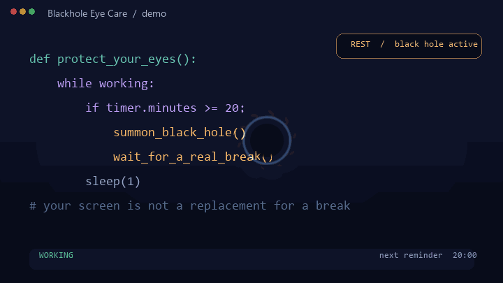

# Blackhole Eye Care

> A beautiful, hard-to-ignore reminder to look away from your screen.

[](https://github.com/haseben/Blackhole-Eye-Care-/releases/latest)
[](https://github.com/haseben/Blackhole-Eye-Care-/releases/latest)
[](LICENSE)
[](README.zh-CN.md)

Blackhole Eye Care is a non-intrusive Windows eye-care assistant based on the **20-20-20 rule**. After a configurable work interval, a GPU-accelerated black hole gradually bends and consumes the desktop until you take a real break.

It is deliberately not another notification that you can dismiss without looking up. Put down the mouse and keyboard, rest, and the black hole fades away so the next work interval can begin.



## Download

**[Download the latest Windows build](https://github.com/haseben/Blackhole-Eye-Care-/releases/latest)** · [View all releases](https://github.com/haseben/Blackhole-Eye-Care-/releases)

The release page includes a portable, single-file `Blackhole-Eye-Care.exe` and a SHA-256 checksum. Windows may show a SmartScreen warning for a new unsigned open-source binary; verify the checksum before running it.

## What makes it different

- **A visual reminder, not a pop-up** — the effect grows slowly, so the interruption is noticeable without being jarring.
- **Automatic rest detection** — no “start break” button. The keyboard and mouse monitor detects sustained inactivity and resets the cycle after the configured rest period.
- **GPU-accelerated rendering** — the OpenGL shader renders gravitational lensing, an accretion disk, Doppler asymmetry, and a photon ring when the graphics driver supports the requested context.
- **Private by design** — this repository contains no telemetry, account system, or network service. The desktop screenshot is used locally as the overlay texture and is not uploaded.

## How it works

```text
WORKING ── work interval reached ──▶ REMINDING ── inactivity ──▶ RESTING
   ▲                                      │                         │
   └──────────── activity resumes ────────┘                         │
                              rest complete ────────────────────────┘
```

The tray application listens for local input with `pynput`. When the work interval is reached, a transparent, click-through overlay captures the current desktop and renders the black-hole shader. Sustained inactivity closes the overlay and starts a fresh work interval.

## Install from source

Requires Windows, Python 3.8+, and a graphics driver capable of the requested OpenGL context.

```bash
git clone https://github.com/haseben/Blackhole-Eye-Care-.git
cd Blackhole-Eye-Care-
python -m pip install -r requirements.txt
python main.py
```

To build a portable executable locally:

```bash
python build_exe.py
```

The output is `dist/Blackhole-Eye-Care.exe`. Tagging a commit with `v*` also runs the included GitHub Actions workflow and publishes the same artifacts to a Release.

## Defaults and settings

Right-click the tray icon and choose **Settings**. Values are stored locally in `%USERPROFILE%\\.eye_care_assistant.json`.

| Setting | Default | Meaning |
| --- | ---: | --- |
| Work interval | 20 minutes | Continuous work before the reminder appears |
| Rest duration | 20 seconds | Sustained inactivity required to reset the cycle |
| Idle threshold | 5 seconds | When inactivity starts counting as a break |
| Maximum black-hole radius | 350 px | Visual size limit |
| Growth rate | 0.003 | Normalized growth per animation frame |
| Drift speed | 1.0 | How quickly the effect moves across the screen |

## Project structure

```text
main.py                # Application entry point and component wiring
black_hole.py          # Transparent OpenGL overlay and animation loop
blackhole.glsl         # Gravitational-lensing fragment shader
timer_manager.py       # WORKING / REMINDING / RESTING state machine
input_monitor.py       # Local keyboard and mouse activity monitor
tray_icon.py           # System tray menu and settings dialog
config.py              # JSON configuration persistence
build_exe.py           # PyInstaller build script
tools/generate_demo.py # Offline visual preview generator
```

## Contributing

Issues and pull requests are welcome. If you change the shader or timing behavior, include a short screen recording or a reproducible test case so the visual and rest-detection behavior can be reviewed.

## License

MIT — see [LICENSE](LICENSE).

简体中文文档：[README.zh-CN.md](README.zh-CN.md)

